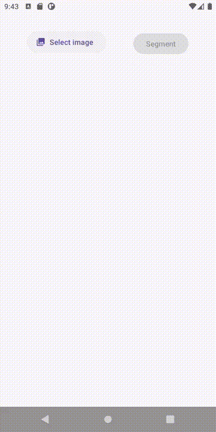

# Object Finder with DeepLabV3 on Android

## Introduction
This android app is written in Kotlin and uses Android Pytorch API to utilize a Pytorch model pretrained with a subset of COCO (using the 20 categories of Pascal VOC). This android project shows an application that lets the user crop an object in an image.

## Environment used
* PyTorch 1.12.1 and torchvision 0.13.1
* Python 3.7.6
* Android Pytorch library pytorch_android_lite:1.12.1 and pytorch_android_torchvision_lite:1.12.1
* Android Studio Chipmunk (2021.2.1)

## Exporting the model
The model is exported by running the script `build_model.py`. Once the execution is finished, the model is serialized in `app/src/main/assets` with the name `deeplabv3_model_optimized_m.ptl`.

## Android Studio
The file `app/build.gradle` includes the dependencies to build the android project. The device used to test the app corresponds to a Pixel 2 XL API Level 30.

### Running the app
The app allows the user to pick an image from the Gallery and select the object that the user wants to extract from the image. Once the object is selected, you can save the image in `AndroidInternalStorage/DCIM`. An example is shown as follows:

